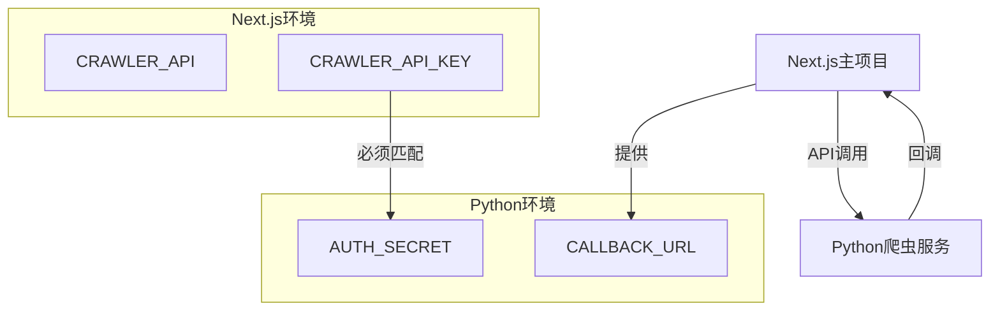

# 爬虫服务配置指南

## 1. 系统架构

### 1.1 项目关系


## 2. 环境变量配置

### 2.1 Next.js项目配置
```env
# 爬虫服务API地址
CRAWLER_API="https://your-crawler-domain/site/crawl_async"

# 爬虫服务验证密钥（必须与Python爬虫的AUTH_SECRET一致）
CRAWLER_API_KEY="your-auth-secret"

# Cron任务验证密钥
CRON_AUTH_KEY="your-cron-key"

# 站点URL（用于构建回调地址）
NEXT_PUBLIC_SITE_URL="https://your-nextjs-site.com"
```

### 2.2 Python爬虫服务配置
```env
# 验证密钥（必须与Next.js的CRAWLER_API_KEY一致）
AUTH_SECRET="your-auth-secret"

# 其他爬虫相关配置
CHROME_PATH="/usr/bin/google-chrome"
SCREENSHOT_PATH="./screenshots"
```

## 3. API接口说明

### 3.1 爬虫调用接口
- **URL**: `${CRAWLER_API}`
- **方法**: POST
- **请求头**:
  ```json
  {
    "Content-Type": "application/json",
    "Authorization": "Bearer ${CRAWLER_API_KEY}"
  }
  ```
- **请求体**:
  ```json
  {
    "url": "要爬取的网站URL",
    "tags": ["可用的分类标签"],
    "callback_url": "爬虫完成后的回调地址",
    "key": "验证密钥"
  }
  ```

### 3.2 回调接口
- **URL**: `/api/cron_callback`
- **方法**: POST
- **请求头**:
  ```json
  {
    "Content-Type": "application/json",
    "Authorization": "Bearer ${CRON_AUTH_KEY}"
  }
  ```
- **请求体**:
  ```json
  {
    "description": "网站描述",
    "detail": "详细信息",
    "name": "网站名称",
    "screenshot_data": "网站截图base64",
    "screenshot_thumbnail_data": "缩略图base64",
    "tags": ["分类标签"],
    "title": "网站标题",
    "url": "网站URL"
  }
  ```

## 4. 部署检查清单

### 4.1 Python爬虫服务
- [ ] 代码已克隆：`git clone https://github.com/ikey123/freeaitools-crawler`
- [ ] 环境变量已配置
- [ ] 依赖已安装：`pip install -r requirements.txt`
- [ ] Chrome浏览器已安装（用于截图）
- [ ] 服务已启动并可访问
- [ ] 验证密钥已设置

### 4.2 Next.js项目
- [ ] 环境变量已配置
- [ ] CRAWLER_API指向正确的爬虫服务地址
- [ ] CRAWLER_API_KEY与爬虫服务的AUTH_SECRET匹配
- [ ] CRON_AUTH_KEY已设置
- [ ] 回调接口可正常访问

## 5. 测试验证

### 5.1 爬虫服务测试
```bash
# 测试爬虫服务是否正常运行
curl -X POST \
  -H "Content-Type: application/json" \
  -H "Authorization: Bearer your-auth-secret" \
  -d '{
    "url": "https://example.com",
    "tags": ["AI"],
    "callback_url": "https://your-nextjs-site.com/api/cron_callback",
    "key": "your-cron-key"
  }' \
  https://your-crawler-domain/site/crawl_async
```

### 5.2 Next.js接口测试
```bash
# 测试cron接口
curl -X POST \
  -H "Authorization: Bearer your-cron-auth-key" \
  http://localhost:3000/api/cron
```

## 6. 常见问题处理

### 6.1 爬虫服务无响应
1. 检查服务是否正常运行
2. 验证网络连接和防火墙设置
3. 确认API地址是否正确

### 6.2 认证失败
1. 检查CRAWLER_API_KEY与AUTH_SECRET是否匹配
2. 确认Authorization头部格式是否正确
3. 验证密钥是否正确设置

### 6.3 回调失败
1. 确认NEXT_PUBLIC_SITE_URL配置正确
2. 检查回调URL是否可访问
3. 验证回调接口的认证信息

## 7. 更新记录

- 2024-01-25: 初始文档创建
- [后续更新记录...]

# API 操作指南

## 一、数据处理流程概述

### 1. 数据流转过程
```mermaid
graph LR
    A[用户提交] --> B[submit表]
    B --> C[/api/cron处理]
    C --> D[爬虫服务]
    D --> E[web_navigation表]
    D --> F[/api/cron_callback更新状态]
```

## 二、手动操作步骤

### 1. 准备数据
需要收集以下信息：
- 网站基本信息（名称、URL、描述）
- 分类信息
- 图片资源（主图、缩略图）
- 其他元数据

### 2. 数据库操作

#### 2.1 连接数据库
```typescript
import { createClient } from '@supabase/supabase-js';

const supabase = createClient(
  process.env.NEXT_PUBLIC_SUPABASE_URL,
  process.env.NEXT_PUBLIC_SUPABASE_ANON_KEY
);
```

#### 2.2 插入提交数据
```sql
-- 插入到 submit 表
INSERT INTO public.submit (
    email,
    url,
    name,
    status,
    created_at
) VALUES (
    'user@example.com',
    'https://example.com',
    '示例网站',
    0,  -- 0表示未处理
    NOW()
);
```

#### 2.3 查询提交状态
```sql
-- 查询未处理的提交
SELECT * FROM public.submit WHERE status = 0 ORDER BY created_at ASC;
```

## 三、API 接口详解

### 1. `/api/cron` 接口

#### 1.1 接口说明
- **功能**：触发爬虫处理提交的数据
- **请求方式**：POST
- **权限要求**：需要 CRON_AUTH_KEY

#### 1.2 完整代码
```typescript
import { NextRequest, NextResponse } from 'next/server';
import { createClient } from '@supabase/supabase-js';

export async function POST(req: NextRequest) {
  try {
    // 1. 验证请求
    const authHeader = req.headers.get('Authorization');
    if (!authHeader || !authHeader.startsWith('Bearer ')) {
      return NextResponse.json(
        { error: 'Authorization header is missing or malformed' },
        { status: 401 }
      );
    }

    const token = authHeader.split(' ')[1];
    const cronKey = process.env.CRON_AUTH_KEY;
    const isValid = cronKey === token;
    if (!isValid) {
      return NextResponse.json(
        { error: 'Invalid token' },
        { status: 401 }
      );
    }

    // 2. 连接数据库
    const supabase = createClient();

    // 3. 获取待处理数据
    const { data: submitList, error: submitListError } = await supabase
      .from('submit')
      .select()
      .eq('status', 0)
      .order('created_at', { ascending: true });

    if (submitListError) {
      throw new Error(submitListError.message);
    }

    // 4. 处理每个提交
    for (const submit of submitList) {
      // 调用爬虫API
      const crawlResult = await fetch(`${process.env.CRAWLER_API}`, {
        method: 'POST',
        headers: {
          'Content-Type': 'application/json',
          'Authorization': `Bearer ${process.env.CRAWLER_API_KEY}`,
        },
        body: JSON.stringify({ url: submit.url }),
      });

      const resultData = await crawlResult.json();

      // 5. 处理爬虫返回数据
      if (resultData.success) {
        // 插入到web_navigation表
        await supabase.from('web_navigation').insert({
          name: resultData.name,
          title: resultData.title,
          content: resultData.content,
          detail: resultData.detail,
          url: submit.url,
          image_url: resultData.image_url,
          thumbnail_url: resultData.thumbnail_url,
          collection_time: new Date().toISOString(),
          tag_name: resultData.tag_name,
          website_data: resultData.website_data,
          star_rating: resultData.star_rating,
          category_name: resultData.category_name,
        });

        // 更新提交状态
        await supabase
          .from('submit')
          .update({ status: 1 })
          .eq('id', submit.id);
      }
    }

    return NextResponse.json({ message: 'Crawling completed successfully' });
  } catch (error) {
    console.error(error);
    return NextResponse.json(
      { error: 'Internal Server Error' },
      { status: 500 }
    );
  }
}
```

#### 1.3 手动调用示例
```bash
curl -X POST http://your-domain/api/cron \
  -H "Authorization: Bearer YOUR_CRON_AUTH_KEY" \
  -H "Content-Type: application/json"
```

### 2. `/api/cron_callback` 接口

#### 2.1 接口说明
- **功能**：更新提交记录的处理状态
- **请求方式**：POST
- **参数说明**：
  - id: 提交记录ID
  - status: 新状态（0:未处理, 1:已处理, 2:处理失败）

#### 2.2 完整代码
```typescript
import { NextRequest, NextResponse } from 'next/server';
import { createClient } from '@supabase/supabase-js';

export async function POST(req: NextRequest) {
  try {
    // 1. 获取请求数据
    const { id, status } = await req.json();

    // 2. 连接数据库
    const supabase = createClient();

    // 3. 更新状态
    const { error } = await supabase
      .from('submit')
      .update({ status })
      .eq('id', id);

    if (error) {
      throw new Error(error.message);
    }

    return NextResponse.json({ message: 'Status updated successfully' });
  } catch (error) {
    console.error(error);
    return NextResponse.json(
      { error: 'Internal Server Error' },
      { status: 500 }
    );
  }
}
```

#### 2.3 手动调用示例
```bash
curl -X POST http://your-domain/api/cron_callback \
  -H "Content-Type: application/json" \
  -d '{"id": 1, "status": 1}'
```

## 四、数据表结构

### 1. submit 表
```sql
CREATE TABLE public.submit (
    id SERIAL PRIMARY KEY,
    email VARCHAR(255),
    url VARCHAR(255) NOT NULL,
    name VARCHAR(255),
    status INTEGER DEFAULT 0,
    created_at TIMESTAMP WITH TIME ZONE DEFAULT NOW()
);
```

### 2. web_navigation 表
```sql
CREATE TABLE public.web_navigation (
    id SERIAL PRIMARY KEY,
    name VARCHAR(255),
    title TEXT,
    content TEXT,
    detail TEXT,
    url VARCHAR(255) UNIQUE,
    image_url TEXT,
    thumbnail_url TEXT,
    collection_time TIMESTAMP WITH TIME ZONE,
    tag_name TEXT[],
    website_data JSONB,
    star_rating INTEGER,
    category_name VARCHAR(255)
);
```

## 五、环境变量配置

```env
# Supabase配置
NEXT_PUBLIC_SUPABASE_URL="https://your-project.supabase.co"
NEXT_PUBLIC_SUPABASE_ANON_KEY="your-anon-key"

# 爬虫API配置
CRAWLER_API="https://crawler-domain/api/crawl"
CRAWLER_API_KEY="your-crawler-api-key"

# 验证密钥
CRON_AUTH_KEY="your-cron-auth-key"
```

## 六、常见问题处理

### 1. 爬虫失败处理
```typescript
// 处理爬虫失败的情况
if (!crawlResult.ok) {
  await supabase
    .from('submit')
    .update({ status: 2, error: 'Crawler failed' })
    .eq('id', submit.id);
  continue;
}
```

### 2. 数据验证
```typescript
// 验证必要字段
if (!resultData.name || !resultData.url) {
  throw new Error('Missing required fields');
}
```

### 3. 错误日志记录
```typescript
// 记录错误日志
const logError = async (error: Error, submitId: number) => {
  await supabase.from('error_logs').insert({
    submit_id: submitId,
    error_message: error.message,
    created_at: new Date().toISOString()
  });
};
```

## 七、测试和调试

### 1. 本地测试
```bash
# 启动开发服务器
npm run dev

# 测试cron接口
curl -X POST http://localhost:3000/api/cron \
  -H "Authorization: Bearer YOUR_CRON_AUTH_KEY"
```

### 2. 生产环境测试
```bash
# 确保环境变量配置正确
# 使用生产环境URL测试接口
```

## 八、更新记录

- 2024-01-25: 初始文档创建
- [后续更新记录...] 